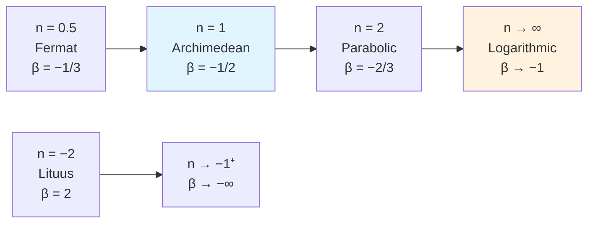

# Plane Spiral Curvature

**Curvature Universality Classes for Plane Spirals**  
β = −n/(n+1) spectrum • Archimedean Proxy • Constant-Δφ Generator • Practical tools for LF/ELF antenna design

[](LICENSE)

A clean synthesis of classical results that organizes all power-law plane spirals under a single asymptotic curvature exponent β, together with two practical computational tools:

1. **Constant-Δφ generative method** – stable, adaptive point distribution for any β
2. **Archimedean proxy** – replaces expensive logarithmic spirals (β = −1) with linear-growth Archimedean spirals (β = −½) for finite-domain work, cutting integration cost by ~10–50× while preserving outer geometry

---

## Core Result

For a polar power spiral `r = θⁿ` (n ≠ −1):

```math
\beta = -\frac{n}{n+1}
```

This is a bijection ℝ∖{−1} → ℝ∖{−1}.  
Inverse: `n = −β/(β+1)`.

### Quick Reference Table

| n     | Spiral name     | β (theory) | Notes                  |
|-------|-----------------|------------|------------------------|
| 0.5   | Fermat          | −1/3       | Phyllotaxis            |
| 1.0   | Archimedean     | −1/2       | Constant gap / proxy   |
| 2.0   | Parabolic       | −2/3       |                        |
| → ∞   | Logarithmic     | → −1       | Frequency-independent  |
| −2    | Lituus          | 2          | Converging             |

---

## β-Spectrum Diagram (Mermaid)



---

## Archimedean vs Logarithmic Comparison

| Property                  | Archimedean (β = −½)     | Logarithmic (β = −1)      | Proxy Usefulness |
|---------------------------|---------------------------|----------------------------|------------------|
| Radial growth             | Linear                    | Exponential                | —                |
| Point density (high turns)| Linear                    | Exponential                | Excellent        |
| Frequency independence    | Near                      | True                       | Geometry stage only |
| Computational cost        | Low                       | High                       | 9–47× speedup    |
| Outer envelope match      | Exact when matched        | —                          | Yes              |

**Rule of thumb**: Use the Archimedean proxy for rapid CAD prototyping and finite-domain simulation. Switch to true logarithmic geometry for final EM performance (impedance, pattern, efficiency).

---

## Quick Start (Python)

```bash
git clone https://github.com/luckyseoul/plane-spiral-curvature.git
cd plane-spiral-curvature
pip install numpy scipy matplotlib
python code/generate_spirals.py
```

Core functions are in `code/generate_spirals.py`:

- `archimedean_proxy_spiral(R_outer, Theta_total, n_points)`
- `compute_curvature(x, y, s)`
- `fit_beta(s, kappa, tail_fraction=0.3)`
- Constant-Δφ generator for any β

Run the example script to produce local PNG figures (spiral gallery, log-log κ(s) plots, proxy comparison).

---

## Personal Use Notes (LF / 630 m Band)

- Generate a 2 m outer-radius Archimedean proxy (15–25 turns) for car-roof or portable layouts.
- Export CSV → FreeCAD / Fusion 360 → .dxf for wire or PCB milling.
- Add loading coil + ferrite for impedance match at ~475 kHz.
- Always finish with full NEC / HFSS simulation on the **true logarithmic** geometry if frequency-independent performance is required.

---

## Paper

See [PAPER.md](PAPER.md) for the complete synthesis note (honest framing, proofs, variational principle, limitations, and code strategies).

---

## License

MIT — free for personal, academic, and commercial use.

---

**Author**: Nicholas Perry  
**Repo**: [luckyseoul/plane-spiral-curvature](https://github.com/luckyseoul/plane-spiral-curvature)
